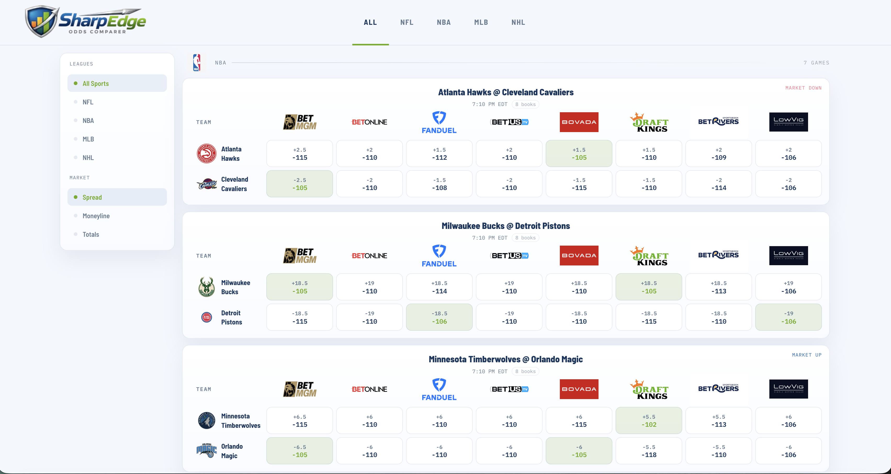

# SharpEdge

SharpEdge is a sportsbook comparison board for quickly scanning spreads, moneylines, and totals across major books in one screen.

It is built for fast line checking, not bet placement: a lightweight React frontend, a Flask backend, cached snapshots from The Odds API, and a branded board experience with league, team, and sportsbook logos.



## Table of Contents

- [Why SharpEdge](#why-sharpedge)
- [Features](#features)
- [Stack](#stack)
- [Project Structure](#project-structure)
- [Getting Started](#getting-started)
- [Environment Variables](#environment-variables)
- [Running Locally](#running-locally)
- [Notes](#notes)

## Why SharpEdge

Most odds tools either feel overloaded, look generic, or make it hard to compare books at a glance.

SharpEdge focuses on:

- a dense comparison-first board
- clean sportsbook and team branding
- quick visibility into best available numbers
- line-movement history and per-game book comparison

## Features

- Multi-sport board for `NFL`, `NBA`, `MLB`, and `NHL`
- Spread, moneyline, and totals comparison
- Best-number highlighting by row
- Per-game detail view with line-movement chart
- League, team, and sportsbook logo support
- Free-plan-safer odds fetching with conservative caching

## Stack

- Frontend: `React`, `Vite`, `React Router`, `Recharts`
- Backend: `Flask`, `Gunicorn`
- Data: `SQLite` snapshot storage
- Odds source: `The Odds API`

## Project Structure

```text
SharpEdge/
├── backend/
│   ├── app.py
│   ├── database.py
│   ├── scheduler.py
│   └── routes/
├── docs/
│   └── readme-screenshots/
├── frontend/
│   ├── public/branding/
│   └── src/
└── README.md
```

## Getting Started

### Prerequisites

- `Node.js 18+`
- `Python 3.9+`
- A `Supabase` project
- A `The Odds API` key

### Environment Variables

Create these files from the examples:

- `backend/.env`
- `frontend/.env`

Backend variables:

```env
ODDS_API_KEY=your_odds_api_key_here
STALE_MINUTES=180
CORS_ORIGINS=http://localhost:5173
DB_PATH=sharpedge.db
FLASK_ENV=development
```

Frontend variables:

```env
VITE_API_BASE_URL=http://localhost:5001
```

## Running Locally

### 1. Start the backend

```bash
cd backend
python3 -m venv venv
source venv/bin/activate
pip install -r requirements.txt
python app.py
```

The backend runs on `http://localhost:5001` by default.

### 2. Start the frontend

```bash
cd frontend
npm install
npm run dev
```

The frontend runs on `http://127.0.0.1:5173` by default, or whichever Vite port is available.

### 3. Build checks

Frontend:

```bash
cd frontend
npm run build
```

Backend syntax check:

```bash
python3 -m py_compile backend/routes/odds.py backend/scheduler.py backend/app.py
```

## Notes

> [!IMPORTANT]
> SharpEdge currently uses a conservative odds refresh strategy designed to be safer on a free The Odds API plan.

- `STALE_MINUTES=180` makes refreshes much less aggressive
- selected sport pages may refresh stale data
- the `All Sports` page is cache-first to reduce accidental credit burn

> [!NOTE]
> This project is currently optimized for solo use and iterative product development, not high-traffic production deployment.
